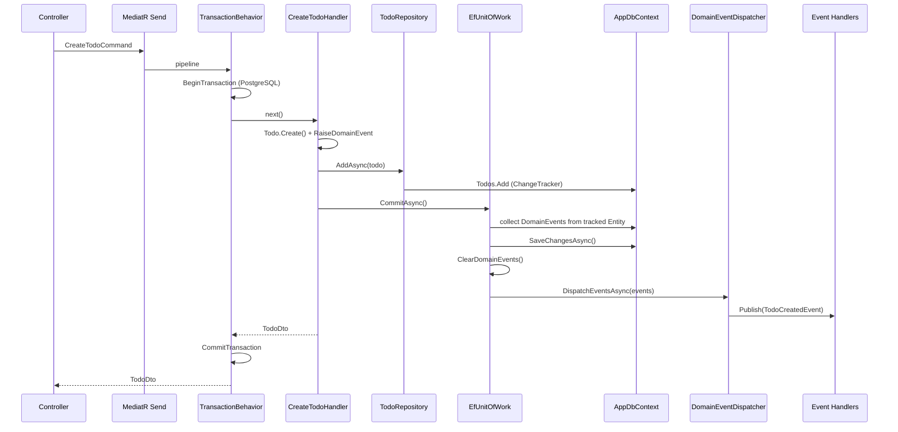

# B-04 — Domain Events (теория)

> **Статус:** full (B-04.1–B-04.3 реализованы в коде)  
> **Практика:** [../backend-phase-04-domain-events.md](../backend-phase-04-domain-events.md)  
> **ADR:** [../../docs/adr/021-domain-events.md](../../docs/adr/021-domain-events.md)  
> **Предшествует:** [b-03-cqrs-mediatr-theory.md](./b-03-cqrs-mediatr-theory.md) · **Следует:** [b-05-keycloak-auth-theory.md](./b-05-keycloak-auth-theory.md)

---

## Шпаргалка — как это работает в TodoPlatform *сейчас*

Вернуться сюда, если забыл поток после паузы.

```
HTTP POST /api/todos
  → TodosController.Send(CreateTodoCommand)
  → MediatR pipeline:
       ValidationBehavior → LoggingBehavior → TransactionBehavior (PostgreSQL only)
  → CreateTodoHandler:
       Todo.Create()              // RaiseDomainEvent(TodoCreatedEvent) в памяти
       repository.AddAsync(todo)  // только db.Todos.Add — без SaveChanges
       unitOfWork.CommitAsync()   // SaveChanges + dispatch events
  → EfUnitOfWork.CommitAsync:
       1) собрать events из ChangeTracker
       2) SaveChangesAsync
       3) ClearDomainEvents
       4) DomainEventDispatcher → mediator.Publish → TodoCreatedAuditHandler, ...
```

| Вопрос | Ответ в нашем коде |
|--------|-------------------|
| Где рождается событие? | В domain-методах (`Todo.Create`, `Complete`, `MarkDeleted`) через `RaiseDomainEvent` |
| Когда уходит в handlers? | После **успешного** `SaveChanges` в `EfUnitOfWork.CommitAsync` |
| Кто сохраняет в БД? | **Не** репозиторий — только `IUnitOfWork.CommitAsync` |
| Command vs Query | Events только у **Commands** (`ICommand`), queries read-only |
| MediatR дважды? | Да: `Send` для command, `Publish` для domain event — разные pipeline |
| Rollback | `TransactionBehavior` откатывает TX; если `SaveChanges` упал — dispatch не вызывается |
| Outbox / RabbitMQ | **Ещё нет** — план B-04.8 / B-07 |

### Карта файлов (реализовано)

| Слой | Файл | Роль |
|------|------|------|
| Domain | `Domain/Common/IDomainEvent.cs` | Маркер + `OccurredOn` |
| Domain | `Domain/Common/Entity.cs` | `_domainEvents`, `RaiseDomainEvent`, `ClearDomainEvents` |
| Domain | `Domain/Events/Todo*Event.cs` | `TodoCreatedEvent`, `TodoCompletedEvent`, `TodoDeletedEvent` |
| Domain | `Domain/Entities/Todo.cs` | Бизнес-методы поднимают события |
| Application | `Application/Common/IDomainEventDispatcher.cs` | Абстракция dispatch |
| Application | `Application/Common/DomainEventDispatcher.cs` | `mediator.Publish` для каждого event |
| Application | `Application/Interfaces/IUnitOfWork.cs` | `CommitAsync` |
| Application | `Application/Todos/EventHandlers/*` | `INotificationHandler<TodoCreatedEvent>` |
| Application | `Application/Todos/Commands/*` | Handler: repository → `CommitAsync` |
| Infrastructure | `Infrastructure/Persistence/EfUnitOfWork.cs` | SaveChanges + dispatch |
| Infrastructure | `Infrastructure/Repositories/TodoRepository.cs` | Только стейдж в ChangeTracker |
| Infrastructure | `Infrastructure/Behaviors/TransactionBehavior.cs` | TX вокруг command pipeline |

---

## 1. Зачем эта тема

**Domain Event** — факт из прошлого: «Todo был создан», «заказ оплачен». Это не намерение пользователя (это **Command**), а запись о том, что уже произошло внутри агрегата.

Зачем в enterprise .NET:

- **Развязка (decoupling):** audit, cache invalidation, search index, email — без раздувания `CreateTodoHandler`.
- **Один агрегат — одна транзакция:** события описывают side effects *после* успешного commit, не в середине бизнес-логики.
- **Путь к messaging:** domain event → outbox → RabbitMQ/Kafka (B-07, B-16) без «голого» `Publish` в handler.

На L63+ спрашивают: *Command vs Domain Event vs Integration Event*, *когда dispatch*, *outbox pattern*, *что если handler упал после SaveChanges*.

---

## 2. Базовые концепции

### 2.1 Command vs Domain Event vs Integration Event

| | Command | Domain Event | Integration Event |
|---|---------|--------------|-------------------|
| **Смысл** | Намерение: «создай todo» | Факт в домене: «todo создан» | Сообщение для другого сервиса/контекста |
| **Время** | Imperative (сделай) | Past tense (создано) | Контракт между bounded contexts |
| **Где живёт** | Application (`CreateTodoCommand`) | Domain (`TodoCreatedEvent`) | Integration layer / outbox payload |
| **Транспорт** | HTTP → MediatR `Send` | In-process `Publish` (сейчас) | RabbitMQ, Kafka (B-07+) |
| **Пример** | `CreateTodoCommand(Title, UserId)` | `TodoCreatedEvent(TodoId, UserId, Title)` | `TodoCreatedIntegrationEvent` (B-07) |

**Правило:** domain event не должен знать про HTTP, Redis или SMTP. Integration event — отдельный DTO, часто маппится из domain event в outbox.

### 2.2 Где хранятся события до dispatch

События **не в БД** на этапе B-04.1–3 — только в памяти на сущности:

```csharp
// Domain/Common/Entity.cs (упрощённо)
private readonly List<IDomainEvent> _domainEvents = [];
public IReadOnlyCollection<IDomainEvent> DomainEvents => _domainEvents.AsReadOnly();

protected void RaiseDomainEvent(IDomainEvent domainEvent) =>
    _domainEvents.Add(domainEvent);

public void ClearDomainEvents() => _domainEvents.Clear();
```

Поднятие в агрегате:

```csharp
// Domain/Entities/Todo.cs (фрагмент)
public static Todo Create(string title, Guid userId, ...)
{
    var todo = new Todo { Title = title.Trim(), UserId = userId, ... };
    todo.RaiseDomainEvent(new TodoCreatedEvent(todo.Id, userId, todo.Title));
    return todo;
}
```

### 2.3 INotification и MediatR

`TodoCreatedEvent` реализует `IDomainEvent` **и** `INotification` (MediatR.Contracts в Domain):

```csharp
public sealed record TodoCreatedEvent(
    Guid TodoId, Guid UserId, string Title)
    : IDomainEvent, INotification
{
    public DateTimeOffset OccurredOn { get; } = DateTimeOffset.UtcNow;
}
```

Handlers в Application:

```csharp
public sealed class TodoCreatedAuditHandler(ILogger<...> logger)
    : INotificationHandler<TodoCreatedEvent>
{
    public Task Handle(TodoCreatedEvent notification, CancellationToken ct)
    {
        logger.LogInformation("Todo created: {TodoId} ...", notification.TodoId, ...);
        return Task.CompletedTask;
    }
}
```

**Важно:** `mediator.Send(command)` и `mediator.Publish(event)` — разные entry points. Pipeline behaviors (Validation, Transaction) оборачивают **Send**, не **Publish**.

---

## 3. Глубокое погружение — полный поток B-04.3

### 3.1 Диаграмма последовательности (CreateTodo)



### 3.2 Разделение Repository и Unit of Work

**До B-04.3** (anti-pattern в нашем проекте): репозиторий сам вызывал `SaveChanges` и dispatch — смешение persistence и transactional boundary.

**После B-04.3:**

| Компонент | Ответственность |
|-----------|-----------------|
| `TodoRepository` | CRUD в ChangeTracker, queries |
| `EfUnitOfWork` | Одна точка commit: save + dispatch |
| Command Handler | Оркестрация use-case: domain → repo → commit |

```csharp
// Application — CreateTodoHandler
var todo = Todo.Create(request.Title, request.UserId);
await repository.AddAsync(todo, cancellationToken);
await unitOfWork.CommitAsync(cancellationToken);
return TodoDto.FromEntity(todo);
```

```csharp
// Infrastructure — TodoRepository.AddAsync
public Task<Todo> AddAsync(Todo todo, CancellationToken ct)
{
    db.Todos.Add(todo);
    return Task.FromResult(todo);
}
```

### 3.3 Алгоритм EfUnitOfWork.CommitAsync

Порядок **намеренный**:

1. **Собрать** копии events с tracked `Entity` (в т.ч. перед delete — пока сущность ещё в трекере).
2. **`SaveChangesAsync`** — если падает, dispatch не выполняется.
3. **`ClearDomainEvents`** — только после успешного save.
4. **`DispatchEventsAsync`** — in-process handlers.

```csharp
// Infrastructure/Persistence/EfUnitOfWork.cs
var pending = db.ChangeTracker.Entries<Entity>()
    .Select(e => e.Entity)
    .Where(e => e.DomainEvents.Count > 0)
    .Select(e => (Entity: e, Events: e.DomainEvents.ToList()))
    .ToList();

await db.SaveChangesAsync(cancellationToken);

foreach (var (entity, _) in pending)
    entity.ClearDomainEvents();

var allEvents = pending.SelectMany(p => p.Events).ToList();
if (allEvents.Count > 0)
    await dispatcher.DispatchEventsAsync(allEvents, cancellationToken);
```

### 3.4 TransactionBehavior и rollback

```csharp
// Infrastructure/Behaviors/TransactionBehavior.cs
if (request is not ICommand || !dbContext.Database.IsRelational())
    return await next();  // InMemory-тесты: без явной TX

await using var transaction = await dbContext.Database.BeginTransactionAsync(ct);
try
{
    var response = await next();  // внутри — handler + CommitAsync
    await transaction.CommitAsync(ct);
    return response;
}
catch
{
    await transaction.RollbackAsync(ct);
    throw;
}
```

| Сценарий | SaveChanges | Dispatch | Данные в БД |
|----------|-------------|----------|-------------|
| Ошибка в handler до `CommitAsync` | нет | нет | нет |
| `SaveChanges` падает | нет | нет | нет (TX rollback на PG) |
| Save OK, dispatch падает | да* | частично | rollback TX на PG |

\*На PostgreSQL внешний `TransactionBehavior` откатит и save, если dispatch бросил исключение до `transaction.CommitAsync`.

**InMemory:** `IsRelational() == false` — транзакция не открывается; `CommitAsync` всё равно сохраняет и dispatch'ит (ограничение тестового провайдера).

### 3.5 MediatR pipeline для Commands (напоминание из B-03)

```
CreateTodoCommand
  → ValidationBehavior
  → LoggingBehavior
  → TransactionBehavior   ← только ICommand + relational DB
  → CreateTodoHandler
```

Queries (`GetTodosQuery`) **не** проходят `TransactionBehavior` как write и **не** вызывают `CommitAsync`.

### 3.6 Текущие event handlers

| Event | Handlers (Application) | Статус |
|-------|------------------------|--------|
| `TodoCreatedEvent` | `TodoCreatedAuditHandler` (Serilog) | работает |
| `TodoCreatedEvent` | `TodoCreatedCacheInvalidator` | stub → B-06 |
| `TodoCompletedEvent` | — | событие есть, handlers позже |
| `TodoDeletedEvent` | — | событие есть, handlers позже |

---

## 4. Примеры кода (C#)

### 4.1 Полный минимальный vertical slice

```csharp
// 1. Domain — событие при создании
var todo = Todo.Create("Learn events", userId);

// 2. Application handler
await repository.AddAsync(todo, ct);
await unitOfWork.CommitAsync(ct);

// 3. Infrastructure — dispatch
await dispatcher.DispatchEventsAsync(events, ct);
// → TodoCreatedAuditHandler пишет в лог
```

### 4.2 Unit-тест handler (mock UoW)

```csharp
var repository = new Mock<ITodoRepository>();
var unitOfWork = new Mock<IUnitOfWork>();
unitOfWork.Setup(u => u.CommitAsync(It.IsAny<CancellationToken>()))
    .Returns(Task.CompletedTask);

var handler = new CreateTodoHandler(repository.Object, unitOfWork.Object);
await handler.Handle(new CreateTodoCommand("Title", userId), CancellationToken.None);

unitOfWork.Verify(u => u.CommitAsync(It.IsAny<CancellationToken>()), Times.Once);
```

### 4.3 Тест: нет dispatch при падении SaveChanges

`tests/TodoPlatform.Infrastructure.Tests/Persistence/EfUnitOfWorkTests.cs` — `ThrowingDbContext` бросает в `SaveChangesAsync`; `IDomainEventDispatcher` не вызывается.

---

## 5. Плюсы / минусы / когда НЕ использовать

| Плюсы | Минусы |
|-------|--------|
| Слабая связность между write и side effects | Два уровня MediatR — легко запутаться |
| Агрегат остаётся фокусом инвариантов | In-process dispatch не переживёт рестарт процесса |
| Единая точка commit (UoW) | Нужна дисциплина: repo без SaveChanges |
| Подготовка к outbox без смены domain | Over-engineering для CRUD из 3 endpoint |

**Когда НЕ использовать:**

- Простой CRUD без side effects и без планов на messaging.
- «События» как замена обычным вызовам сервисов в том же handler без границы агрегата.
- Cross-aggregate транзакции через цепочку domain events в одном процессе (риск каскада и скрытых зависимостей).

---

## 6. Сравнение с альтернативами

| Подход | Популярность | Когда выбрать |
|--------|--------------|---------------|
| **Domain events in-memory + MediatR Publish** | ★★★★☆ | Modular monolith, наш B-04 |
| **Direct service calls в handler** | ★★★☆☆ | Мало side effects, прототип |
| **Transactional Outbox** | ★★★★★ | Надёжная доставка в Rabbit/Kafka (B-07) |
| **Event Sourcing** | ★★★☆☆ | Audit/time-travel, высокая сложность |
| **EF `SaveChanges` interceptor** | ★★★☆☆ | Скрытая магия; сложнее тестировать |
| **Hangfire/background job сразу в handler** | ★★★☆☆ | Без гарантии согласованности с TX |

---

## 7. Типичные ошибки и anti-patterns

- **Dispatch до SaveChanges** — handlers видят данные, которых ещё нет в БД; при rollback — ложные side effects.
- **SaveChanges в репозитории** — ломает UoW, двойной commit, события dispatch не в той точке.
- **Domain event с зависимостями от Infrastructure** — нарушение Clean Architecture.
- **Использовать domain event как integration contract** — внешние потребители привязаны к внутренней модели.
- **Тяжёлая логика в `INotificationHandler`** — блокирует HTTP request; тяжёлое → outbox + consumer (B-07).
- **Путать `Send` и `Publish`** — behaviors не применяются к events так же, как к commands.
- **Забыть `ClearDomainEvents`** — повторный save может переотправить те же события.

---

## 8. Вопросы на интервью (L63–L65)

1. **Command vs Domain Event?** — Command = intent; Event = fact после изменения state агрегата.
2. **Когда dispatch domain events?** — После успешного persistence в той же transactional boundary (у нас — в `CommitAsync`).
3. **Domain Event vs Integration Event?** — Domain внутри bounded context; integration — контракт между сервисами, часто через outbox.
4. **Что если notification handler упал?** — In-process: исключение всплывает; с outbox: retry в consumer; без outbox — риск inconsistency.
5. **Нужен ли UoW если есть `TransactionBehavior`?** — UoW = семантика commit + events; Behavior = обёртка DB transaction вокруг всего handler.
6. **Можно ли в query поднимать domain events?** — Антипаттерн; queries без side effects.
7. **Как тестировать без БД?** — Mock `ITodoRepository` + `IUnitOfWork`; integration — `EfUnitOfWork` + InMemory.

---

## 9. Связь с другими фазами

| Фаза | Связь |
|------|-------|
| **B-03** | Commands/handlers, `TransactionBehavior`, `ICommand` |
| **B-04.4–6** | Specification pattern — queries, не events |
| **B-04.7** | Расширенный `IUnitOfWork` (`RollbackAsync`, `Repository<T>`) |
| **B-04.8** | Таблица `outbox_messages`, запись events при commit |
| **B-06** | `TodoCreatedCacheInvalidator` — реальная invalidation |
| **B-07** | Outbox publisher → `TodoCreatedIntegrationEvent` → RabbitMQ |
| **B-13** | SignalR realtime — **не** напрямую из domain event в UI |
| **B-16** | Audit stream / Kafka из integration events |

### Roadmap внутри B-04 (чеклист)

- [x] B-04.1 — `IDomainEvent`, `Entity`, события на `Todo`
- [x] B-04.2 — `DomainEventDispatcher`, audit/cache handlers
- [x] B-04.3 — Repository без SaveChanges, `EfUnitOfWork.CommitAsync`
- [ ] B-04.4–6 — Specification pattern
- [ ] B-04.7 — полный UoW + `TransactionBehavior` → UoW
- [ ] B-04.8 — Outbox schema
- [ ] B-04.9 — тесты outbox + ADR финализация

---

## 10. Дополнительные ресурсы

- [ADR-021: Domain Events vs Integration Events](../../docs/adr/021-domain-events.md)
- [Microsoft: Domain events design](https://learn.microsoft.com/dotnet/architecture/microservices/microservice-ddd-cqrs-patterns/domain-events-design-and-implementation)
- [Microsoft: Outbox pattern](https://learn.microsoft.com/azure/architecture/patterns/outbox)
- Vaughn Vernon — *Implementing Domain-Driven Design* (domain events chapter)
- Jimmy Bogard — MediatR notifications
- Практика в репо: `tests/TodoPlatform.Infrastructure.Tests/Persistence/EfUnitOfWorkTests.cs`
